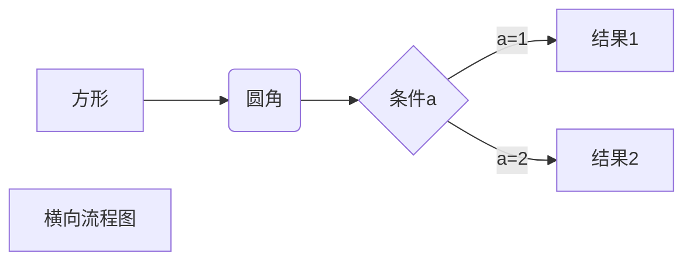
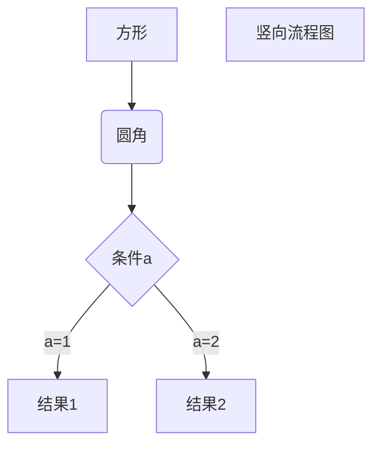
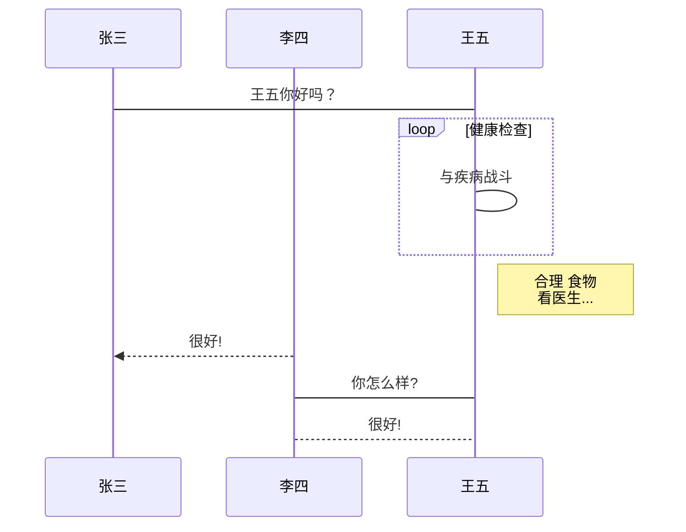
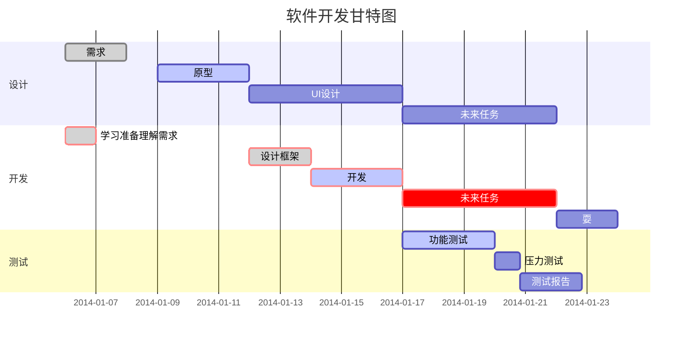

## Welcome to GitHub Pages

:cn: :atom:

:book: 	:books: :pen:

:iphone:  :computer: :film_projector:  :clapper: 

:earth_asia: :boat: :rocket: :alarm_clock: 	:sunny: :sun_behind_small_cloud:

👍 :smile:  :joy:   :medal_military:  :medal_sports: :dart: :headphones:

:warning: :exclamation: :white_check_mark: :negative_squared_cross_mark: 	:triangular_flag_on_post:

:heart: :orange_heart: :moneybag:  :dollar: 

:ok_hand: :v: :+1: :clap: :handshake:

:ear:  :farmer:  :man_farmer: 	:man_judge:  :woman_judge: :technologist:

:artist: :policeman: :merman: 

:runner:  :running_man:  :running_woman: :footprints:

:climbing: :climbing_woman: 

:bouncing_ball_person: :basketball_man:

:lotus_position: :lotus_position_woman:

:couple: :two_men_holding_hands:  :family_man_woman_girl:  :family_man_woman_girl_boy:

- [x] 3.26
- [ ] 3.27

***粗体+斜体***
**粗体 _斜体_ 粗体**
**粗体**
*斜体*
~~删除线~~

```C
printf("hello");
```


Dark Theme	

Light Theme	

- 项目1
- 项目2
- 项目3

+ 项目1
+ 项目2
+ 项目3

- 项目1
  - 项目2
  - 项目3
- 项目4
  - 项目5
  - 项目6

- [x] #739
- [ ] https://github.com/octo-org/octo-repo/issues/740
- [ ] Add delight to the experience when all tasks are complete :tada:

通过键入 :EMOJICODE: 可在您的写作中添加表情符号。

@octocat :+1: 这个 PR 看起来很棒 - 可以合并了！ :shipit:

渲染的表情符号

Here is a simple footnote[^1].

A footnote can also have multiple lines[^2].  

You can also use words, to fit your writing style more closely[^note].

[^1]: My reference.
[^2]: Every new line should be prefixed with 2 spaces.  
  This allows you to have a footnote with multiple lines.
[^note]:
    Named footnotes will still render with numbers instead of the text but allow easier identification and linking.  
    This footnote also has been made with a different syntax using 4 spaces for new lines.

> 注意：Markdown 中脚注的位置不会影响该脚注的呈现位置。 您可以在引用脚注后立即写脚注，脚注仍将呈现在 Markdown 的底部。

<!-- This content will not appear in the rendered Markdown -->

让我们将 \*our-new-project\* 重命名为 \*our-old-project\*。

When viewing a Markdown file, you can click  at the top of the file to disable Markdown rendering and view the file's source instead.


Disabling Markdown rendering enables you to use source view features, such as line linking, which is not possible when viewing rendered Markdown files.

| 列1 | 列2 | 列3 |
| --- | --- | --- |
| 内容1 | 内容2 | 内容3 |

You can use the [editor on GitHub](https://github.com/csu18/csu18/edit/gh-pages/index.md) to maintain and preview the content for your website in Markdown files.

Whenever you commit to this repository, GitHub Pages will run [Jekyll](https://jekyllrb.com/) to rebuild the pages in your site, from the content in your Markdown files.

[Markdown 高级技巧](https://www.runoob.com/markdown/md-advance.html)

不在 Markdown 涵盖范围之内的标签，都可以直接在文档里面用 HTML 撰写。

目前支持的 HTML 元素有：<kbd> <b> <i> <em> <sup> <sub> <br>等 ，如：
  
使用 <kbd>Ctrl</kbd>+<kbd>Alt</kbd>+<kbd>Del</kbd> 重启电脑

1、横向流程图源码格式：



2、竖向流程图源码格式：



3、标准流程图源码格式：

```flow
st=>start: 开始框
op=>operation: 处理框
cond=>condition: 判断框(是或否?)
sub1=>subroutine: 子流程
io=>inputoutput: 输入输出框
e=>end: 结束框
st->op->cond
cond(yes)->io->e
cond(no)->sub1(right)->op
```

4、标准流程图源码格式（横向）：

```flow
st=>start: 开始框
op=>operation: 处理框
cond=>condition: 判断框(是或否?)
sub1=>subroutine: 子流程
io=>inputoutput: 输入输出框
e=>end: 结束框
st(right)->op(right)->cond
cond(yes)->io(bottom)->e
cond(no)->sub1(right)->op
```

5、UML时序图源码样例：

```sequence
对象A->对象B: 对象B你好吗?（请求）
Note right of 对象B: 对象B的描述
Note left of 对象A: 对象A的描述(提示)
对象B-->对象A: 我很好(响应)
对象A->对象B: 你真的好吗？
```

6、UML时序图源码复杂样例：

```sequence
Title: 标题：复杂使用
对象A->对象B: 对象B你好吗?（请求）
Note right of 对象B: 对象B的描述
Note left of 对象A: 对象A的描述(提示)
对象B-->对象A: 我很好(响应)
对象B->小三: 你好吗
小三-->>对象A: 对象B找我了
对象A->对象B: 你真的好吗？
Note over 小三,对象B: 我们是朋友
participant C
Note right of C: 没人陪我玩
```

7、UML标准时序图样例：



8、甘特图样例：



  
### [了不起的Markdown](https://www.dedao.cn/ebook/reader?id=N5lDqb9b47pXZxGn1kBzPlMyQArYv0q96e0qe85E2aVKdo9jNgOLRmDJ6nXLm16K)


《失控》《必然》等畅销书的作者Kevin Kelly在一次演讲中提到：

> “关于技术，在最开始时，没有人知道新的发明最适合用于做什么，例如爱迪生的留声机，他原本不知道这能用来干什么。留生机慢慢被应用于两个场景：一是录下临终遗言；二是录下教堂里的讲话，包括唱歌。后来留声机主要用于录制音乐等。”

所以说“技术的用途，是用出来的”

Markdown也是如此。

起初，发明Markdown只是为了简化文章的排版，后来人们不断地尝试把它应用到各种写作场景中，并与一些专业的软件相结合，于是才有了这么多好用的Markdown工具。
如今，Markdown几乎随处可见，并且扮演着越来越重要的角色。知乎、简书、CSDN、GitHub、WordPress、印象笔记、有道笔记等都支持Markdown。用Markdown可以写书、写幻灯片、写邮件、写日记、写便签、记笔记、写博客，说Markdown是最流行的“写作语言”一点也不为过。

我们都知道Markdown的特点就是简单易用，如果想要学习它，网上已经有很多文章，可我为什么还要写这本书呢?其实只要你用心观察就不难发现，虽然网上介绍Markdown的文章满天飞，但这些内容都比较碎片化，读者并不能通过这些碎片化的信息全面系统地学习Markdown。

我曾经在微博上看到过这么一段话，大意是说，当我决定是否写一篇文章时，首先要看类似的内容是否已有人写过；如果有，再看我是否有新的观点，或者能否写得更好；能否写得更系统、更全面、更通俗易懂。
这也是本书的写作初衷—为了让更多的人更全面地了解并使用Markdown。

据 GitHub Flavored Markdown（GFM）官方文档介绍，Markdown是由约翰·格鲁伯（John Gruber）在亚伦·斯沃茨（Aaron Swartz）的帮助下开发，并在2004年发布的标记语言。
其设计灵感主要来源于纯文本电子邮件的格式，目标是让人们能够使用易读、易写的纯文本格式编写文档，而且这些文档可以转换为HTML（HyperText Markup Language，超文本标记语言）文档。
简单点说，Markdown就是由一些简单的符号/（如*/-> [] （）#）/组成的用于排版的标记语言，其最重要的特点就是可读性强。

### Markdown


Markdown is a lightweight and easy-to-use syntax for styling your writing. It includes conventions for

```markdown
Syntax highlighted code block

# Header 1
## Header 2
### Header 3

- Bulleted
- List

1. Numbered
2. List

**Bold** and _Italic_ and `Code` text

[Link](url) and 
```

For more details see [Basic writing and formatting syntax](https://docs.github.com/en/github/writing-on-github/getting-started-with-writing-and-formatting-on-github/basic-writing-and-formatting-syntax).

### Jekyll Themes

Your Pages site will use the layout and styles from the Jekyll theme you have selected in your [repository settings](https://github.com/csu18/csu18/settings/pages). The name of this theme is saved in the Jekyll `_config.yml` configuration file.

### Support or Contact

Having trouble with Pages? Check out our [documentation](https://docs.github.com/categories/github-pages-basics/) or [contact support](https://support.github.com/contact) and we’ll help you sort it out.

### Reference

1. [GitHub Flavored Markdown Spec](https://github.github.com/gfm/)
2. [关于在 GitHub 上编写和设置格式](https://docs.github.com/cn/get-started/writing-on-github/getting-started-with-writing-and-formatting-on-github/about-writing-and-formatting-on-github)
3. [基本撰写和格式语法](https://docs.github.com/cn/get-started/writing-on-github/getting-started-with-writing-and-formatting-on-github/basic-writing-and-formatting-syntax)
4. [使用高级格式](https://docs.github.com/cn/get-started/writing-on-github/working-with-advanced-formatting)
5. [emoji-cheat-sheet](https://github.com/ikatyang/emoji-cheat-sheet/blob/master/README.md) 
6. [Markdown 高级技巧](https://www.runoob.com/markdown/md-advance.html)
7. [MarkDown高级技巧](https://www.jianshu.com/p/4cfb39ff85e9) 
